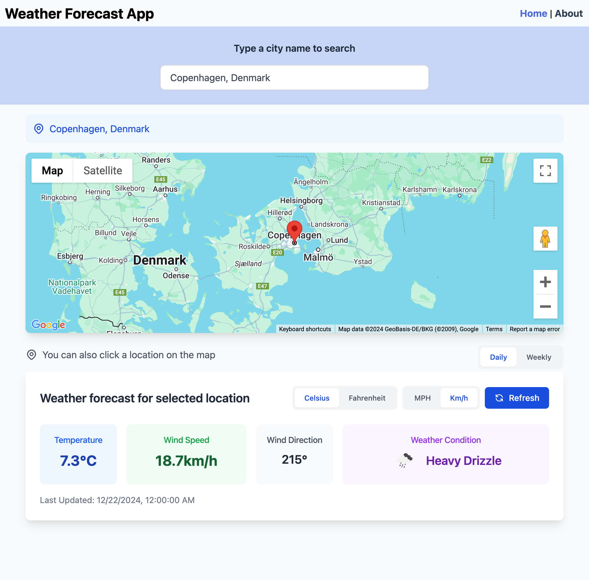

# Weather Forecast Application

A modern weather forecast application built with Vue.js and Express.js, featuring real-time weather data, interactive maps, and a responsive design.

<div align="center">
  
</div>

> View [Desktop Weekly Forecast Screenshot](screenshot-weekly.jpg)

> View [Mobile Screenshot](screenshot-mobile.jpg)

> View [Mobile Weekly Forecast Screenshot](screenshot-mobile-weekly.jpg)

## Features

- 🌍 Interactive Google Maps integration for location selection
- 🔍 Location search with Google Places Autocomplete
- 📅 Toggle between daily and weekly forecasts
- 🌤️ Real-time weather data from Open-Meteo API
- 🔄 Unit conversion support:
  - Temperature (Celsius/Fahrenheit)
  - Wind Speed (Km/h/MPH)
- 📱 Responsive design for mobile and desktop
- 🎨 Modern UI with Tailwind CSS
- 🧪 End-to-end testing with Cypress
- 🚀 CI/CD pipeline with GitHub Actions and Coolify
- 🐳 Docker containerization for easy deployment

## Tech Stack

### Frontend
- Vue.js 3
- TypeScript
- Tailwind CSS
- Google Maps API
- Cypress for E2E testing

### Backend
- Express.js
- TypeScript
- Open-Meteo API integration

### DevOps
- Docker & Docker Compose
- GitHub Actions
- Coolify for deployment
- GitHub Container Registry

## Local Development Setup

### Prerequisites
- Node.js 18+
- Yarn 3.8.7+
- Docker and Docker Compose
- Google Maps API key

### Environment Setup

1. Clone the repository:
```bash
git clone https://github.com/yourusername/weather-forecast-test-app.git
cd weather-forecast-test-app
```

2. Set up environment variables:

Frontend (.env.development):
```env
VUE_APP_BACKEND_API_URL=http://localhost:3000
VUE_APP_GOOGLE_MAPS_API_KEY=your_google_maps_api_key
```

3. Install dependencies:

Backend:
```bash
cd backend
yarn install
```

Frontend:
```bash
cd frontend
yarn install
```

### Running the Application

1. Start the backend server:
```bash
cd backend
yarn serve
```

2. Start the frontend development server:
```bash
cd frontend
yarn serve
```

3. Access the application at http://localhost:8080

### Running Tests

```bash
cd frontend
yarn test:e2e        # Run tests in headless mode
yarn test:e2e:open   # Open Cypress UI for interactive testing
```

## Deployment

The application is configured for automated deployment using GitHub Actions and Coolify.

### CI/CD Pipeline

1. Push to main branch triggers:
   - Cypress E2E tests
   - Docker image builds
   - Automatic deployment to Coolify

2. Required secrets in GitHub:
   - COOLIFY_TOKEN
   - COOLIFY_WEBHOOK
   - VUE_APP_GOOGLE_MAPS_API_KEY
   - VUE_APP_BACKEND_API_URL

## Development Journey and Challenges

### Challenges Faced and Solutions

1. **Yarn Installation Issues**
   - Problem: Typescript patch errors during yarn install
   - Solution: Updated to Yarn 3.8.7 using Corepack
   ```bash
   corepack prepare yarn@3.8.7 --activate
   ```

2. **Weather Data Integration**
   - Challenge: Mapping WMO weather codes to user-friendly descriptions
   - Solution: Created a comprehensive mapping in `wmo-descriptions.json`
   - Resources: [WMO Code Reference](https://www.nodc.noaa.gov/archive/arc0021/0002199/1.1/data/0-data/HTML/WMO-CODE/WMO4677.HTM)

3. **Google Maps Integration**
   - Challenge: Reverse geocoding for clicked locations
   - Solution: Implemented Google Maps Geocoding API
   - Documentation: [Google Maps Geocoding API](https://developers.google.com/maps/documentation/geocoding/requests-reverse-geocoding)

4. **CI/CD and Docker Deployment**
   - Challenge: GitHub Actions workflow failing with service configuration errors
   - Solution: Simplified the workflow by running backend directly in test job instead of using service containers
   ```yaml
   # Before: Complex service configuration that failed
   services:
     backend:
       image: node:18-alpine
       working-dir: /app  # This caused issues
       command: sh -c "yarn install && yarn serve"

   # After: Simpler approach running directly in job steps
   steps:
     - name: Install Backend Dependencies
       working-directory: ./backend
       run: yarn install
     - name: Start Backend Server
       run: yarn serve &
   ```

   - Challenge: Docker Compose command not found in GitHub Actions
   - Solution: Added Docker Compose plugin installation step
   ```yaml
    - name: Set up Docker Buildx
    uses: docker/setup-buildx-action@v2
   ```

   - Challenge: Port conflicts in Coolify deployment
   - Solution: Changed from fixed ports to expose in docker-compose.yml
   ```yaml
   # Before: Fixed port mapping
   ports:
     - "80:80"
   
   # After: Using expose for Coolify to manage ports
   expose:
     - "80"
   ```

### Future Improvements

1. **Performance Optimization**
   - Implement throttling for API calls
   - Add caching for weather data
   - Optimize bundle size

2. **Code Quality**
   - Share TypeScript models between frontend and backend
   - Add unit tests
   - Implement error boundaries

3. **Features**
   - Extended forecast view
   - Weather alerts
   - User location preferences

## Resources

- [Open-Meteo API Documentation](https://open-meteo.com/)
- [Vue.js Documentation](https://vuejs.org/)
- [Cypress Documentation](https://docs.cypress.io/)
- [Google Maps Platform Documentation](https://developers.google.com/maps/documentation)
- [Coolify Documentation](https://coolify.io/docs/)
- [GitHub Actions Documentation](https://docs.github.com/en/actions)